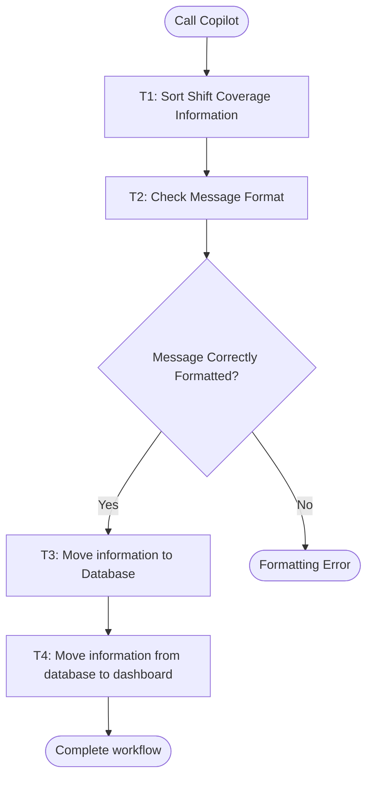

# Workflow of Tasks

## 1. Workflow Goal

This workflow supports the goal in our completed [team charter](https://github.com/arlowe928-lab/BUS4498_Team_Build-/blob/main/README.md). The workflow coordinates Sort Shift Coverage Information , Check Message Format, Move information to Database , Move information from database to dashboard . Its intended result is: A visual dashboard of shifts needing to be covered.

## 2. Workflow Trigger

Employee types "Copilot: I need a shift covered: date (xx/xx/xxxx), shift time (xx:xx(am/pm)-xx:xx(am/pm)), reason for coverage (school, sick, family or other)"

## 3. Completion Condition at Runtime

A visual dashboard of shifts needing to be covered.

## 4. General Workflow

The workflow starts when an employee types "Copilot: I need a shift covered: date (xx/xx/xxxx), shift time (xx:xx(am/pm)-xx:xx(am/pm)), reason for coverage (school, sick, family or other)".

T1 · Sort Shift Coverage Information: Copilot reads the sent messages and pulls the employee’s first name and last initial, shift date, shift time, and reason for coverage (school, sick, family, or other).

T1 routes to D1 · Message Correctly Formatted? If the message is correctly formatted, D1 routes to T3 · Move information to Database, where Copilot moves the correctly formatted data to a PostgreSQL database. T3 routes to T4 · Move information from the database to the dashboard, where Copilot threads the information from the database to a calendar dashboard for employees to view. T4 routes to END · Complete workflow, resulting in a visual dashboard of shifts needing to be covered.

If the message is not correctly formatted, D1 routes to STOP1 · Formatting Error. Copilot returns a message asking the employee to format the shift date, shift time, and reason for coverage accordingly and try again; STOP1 returns to D1.

Exception handling is not yet specified in the task specifications.

## 5. Workflow Diagram

